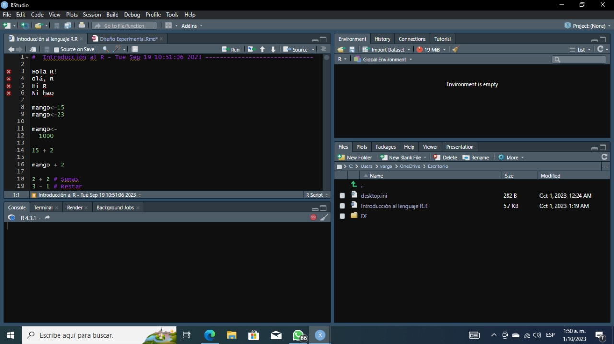

### *Introducción al R.*

#### [Descripción.]{style="color: green"}

R Studio es un entorno dedicado a trabajar con el lenguaje R y está diseñado para ser una herramienta poderosa para programadores y analistas de datos que utilizan R en sus proyectos.



### *Variables en R.*

#### [Descripción.]{style="color: green"}

Este código realiza una serie de asignaciones de valores a variables, realiza operaciones aritméticas simples y realiza comparaciones lógicas para verificar relaciones entre números y valores de variables. Los resultados de estas operaciones se muestran en la consola de R.

```{r}
mango<-15
mango<-23

mango<- 
  1000

15 + 2

mango + 2

2 + 2 #Sumas   
3 - 1 #Restar  
4*5 #Multiplicar 
12 / 3 #Dividir 
7 ^ 2   #Al cuadrado 
0:25  #Series  
3 == 5  #Es igual?
5 != 0  #Es distino?
2 > 9   #Mayor 
1 < 8   #Menor
5 >= 5  #Mayor o igual
4 <= 1  #Menor o ogual
mango < -1 #comparacion de texto y numero

meu_primeiro_objeto <- 160
```

### *Creación De Variables En R.*

#### [Descripción.]{style="color: green"}

Este código ilustra la creación de variables en R, la asignación de valores de texto y numéricos a esas variables, y cómo realizar comparaciones de igualdad y desigualdad entre variables de texto.

```{r}
meu_primeiro_objeto <- 160

nome_1 <- "usp" # comillas PARA TODOS LOS VALORES TEXTUALES 
# (CARACTERES)

nome_1

nome_2 <- 'usp'

nome_2


nome_1 == nome_2

nome_1 != nome_2

verdadeiro <- nome_1 == nome_2

verdadeiro


falso <- nome_1 != nome_2

falso
```

### *Otros Valores Importantes En R.*

#### [Descripción.]{style="color: green"}

Estos valores y constantes tienen roles específicos en R:

-   TRUE y FALSE son valores lógicos para expresar la verdad o falsedad de afirmaciones.
-   NA representa valores faltantes o desconocidos. NULL indica la ausencia de contenido.
-   Inf y -Inf representan infinito positivo y negativo en el contexto numérico.

```{r}
TRUE #logical
T #logical
FALSE #logical
F #logical
NA #logical ES DISTINO DE CERO!!!!!!
NULL #NULL
Inf #numeric
-Inf #numeric
```

### *Creación De Vectores.*

#### [Descripción.]{style="color: green"}

Errores en la creación de vectores:

a.  vetor \<- 1 2 3 4 5 6 7 8 9 10: Este intento da error porque no se están utilizando comas ni un operador para separar los elementos del vector. En R, necesitas usar comas o el operador c() para definir un vector.

b.  vetor \<- 1, 2, 3, 4, 5, 6, 7, 8, 9, 10: Este intento también da error porque las comas no son suficientes para definir un vector. R necesita que utilices la función c() para concatenar los elementos en un vector.

c.  vetor \<- (1, 2, 3, 4, 5, 6, 7, 8, 9, 10): Al igual que en el intento anterior, el uso de paréntesis no es suficiente para definir un vector en R. Debes utilizar c().

Esta es la forma correcta de crear un vector en R. Aquí, c() es una función que se utiliza para concatenar elementos y crear un vector. Los números del 1 al 10 están separados por comas dentro de c(), lo que crea un vector llamado vetor que contiene esos números.

Al ejecutar este código, el resultado será un vector llamado vetor con los valores del 1 al 10.

```{r}
vetor <- 
  c(1, 2, 3, 4, 5, 6, 7, 8, 9, 10)
vetor
```

### *Valores Textuales.*

#### [Descripción.]{style="color: green"}

Este código crea un vector llamado nomes que almacena nombres como valores textuales y luego muestra el contenido de ese vector en la consola de R.

```{r}

nomes <- c("mariana", "pedro", "daniela")
nomes
```

### *Funciones.*

#### [Descripción.]{style="color: green"}

Estos códigos demuestran cómo utilizar la función round() para redondear números en R y cómo obtener información sobre sus argumentos y funcionalidad a través de la ayuda y la función args().

```{r}

# redondear:
round(
  x = 3.141592)

round(x = 3.141592, digits = 2)

# argumentos 

?round

# o asi:
args(round)

round
```

### *Coerción.*

#### [Descripción.]{style="color: green"}

El código muestra cómo R maneja la coerción automática para asegurarse de que todos los elementos de un vector sean del mismo tipo y cómo puedes verificar el tipo de datos de diferentes objetos utilizando la función class().

```{r}
nomes_e_idades <- c("mariana", 22, "pedro", 30, "daniela", 45)

nomes_e_idades

?class
class(nomes_e_idades)
class(meu_primeiro_objeto)
class(verdadeiro)

# De nuevo:
class(nomes_e_idades)
```

### *Jerarquias.*

#### [Descripción.]{style="color: green"}

EN R decide automáticamente el tipo de datos predominante en un vector cuando se mezclan diferentes tipos de datos. La jerarquía predeterminada es: valores textuales \> valores numéricos \> valores lógicos. Los valores textuales tienen la prioridad más alta, seguidos de los valores numéricos y finalmente los valores lógicos.

```{r}

teste <- c("laranja", 230, FALSE)

teste

class(teste)

outro_teste <- c(12, 37, FALSE, TRUE, FALSE, TRUE, TRUE, TRUE, TRUE)

outro_teste

class(outro_teste)

missings <- c(12, 37, FALSE, TRUE, FALSE, TRUE, TRUE, TRUE, TRUE, NA)

missings

class(missings)
```

### *Variables Categoricas.*

#### [Descripción.]{style="color: green"}

#### Este código en R crea un vector llamado 'tipo_sanguineo' que contiene los tipos sanguíneos como valores categóricos, y luego verifica el tipo de datos de ese vector, se crea un vector que almacena tipos sanguíneos como valores categóricos representados por cadenas de texto y verifica que el tipo de datos del vector sea "character".

```{r}

tipo_sanguineo <- c(
  "A+", "A-", "B+", "B-", "AB+", "AB-", "O+", "O-")

tipo_sanguineo

class(tipo_sanguineo)
```

### *TransformaciOn.*

#### [Descripción.]{style="color: green"}

Este código en R realiza una transformación en el vector 'tipo_sanguineo' de valores categóricos representados como cadenas de texto. El código transforma el vector 'tipo_sanguineo' de valores categóricos representados como cadenas de texto en un factor, que es una estructura de datos especializada para representar variables categóricas en R. Después de la transformación, el vector es tratado y reconocido como un factor en lugar de un vector de caracteres.

```{r}

tipo_sanguineo <- factor(tipo_sanguineo)

tipo_sanguineo

class(tipo_sanguineo)
```

### *Variables Nominales.*

#### [Descripción.]{style="color: green"}

El código crea un objeto 'nivel_escolarizacao' que contiene categorías relacionadas con niveles de escolarización. Estas categorías son tratadas como cadenas de texto en este momento, pero si deseas trabajar con ellas como niveles ordinales, es posible que debas realizar una transformación adicional para indicar su orden en la escala ordinal. para variables nominales, no necesitas realizar ningún paso adicional después de crear el objeto con las categorías. Pero para variables ordinales, debes realizar pasos adicionales para indicar el orden específico de las categorías.

```{r}
nivel_escolarizacao <- c("fundamental", "medio", "pregrado")

nivel_escolarizacao

class(nivel_escolarizacao)
```

### *Funciones De Factores.*

#### [Descripción.]{style="color: green"}

Este código en R realiza dos acciones principales:

1.  'nivel_escolarizacao \<- factor(nivel_escolarizacao)': Con esta línea, se utiliza la función 'factor()' para convertir el objeto 'nivel_escolarizacao' en un factor. Esto es especialmente útil cuando se trabaja con variables ordinales, ya que permite establecer un orden específico para las categorías.

2.  'nivel_escolarizacao \<- factor(nivel_escolarizacao, levels = c("medio", "fundamental", "pregrado"))': Aquí, se vuelve a utilizar la función 'factor()', pero esta vez se establece el orden de las categorías mediante el argumento 'levels'. Se especifica que el orden deseado de las categorías es "medio", "fundamental" y "pregrado".

3.  'class(nivel_escolarizacao)': Se verifica el tipo de datos del objeto 'nivel_escolarizacao' después de la transformación. El resultado será "factor", ya que el objeto ahora se considera un factor con un orden específico para las categorías.

```{r}

nivel_escolarizacao <- factor(nivel_escolarizacao)

class(nivel_escolarizacao)

nivel_escolarizacao

# Nivel de factor():

nivel_escolarizacao <- factor(nivel_escolarizacao,
                              levels = c("medio",
                                         "fundamental",
                                         "pregrado"))
?factor

```

### *Creacion De Vectores Y Representacion De Serie De Datos.*

#### [Descripción.]{style="color: green"}

Estos códigos en R crean vectores y representan una serie de datos sobre empresas y sus características.La informacion es dada en el codigo se puede introduccior nombre de la empresa, número de empleados, cotización en bolsa, sede en Brasil y el nombre de diferentes jecutivos. Los valores 'NA' se utilizan para indicar información faltante en algunos casos.

```{r}
empresas <- c("Empresa A", NA, "Empresa C", "Empresa D", "Empresa E")
funcionarios <- c(100, 5000, 230, 12000, 1700)
presenca_bolsa <- c(F,T,NA,T,TRUE)
sede_brasil <- c(NA,0,1,0,0)
diretor_executivo <- c(NA,"daniel","carlos","carla","solange")
```

### *Número De Elementos.*

#### [Descripción.]{style="color: green"}

Estas líneas de código se utilizan para determinar cuántos elementos hay en cada uno de los vectores 'empresas', 'funcionarios', 'presenca_bolsa', 'sede_brasil' y 'diretor_executivo'. Esto puede ser útil para verificar la cantidad de datos disponibles en cada uno de estos vectores o para realizar análisis de datos más adelante en su código.

```{r}
length(empresas)
length(funcionarios)
length(presenca_bolsa)
length(sede_brasil)
length(diretor_executivo)

```

### *Número De Elementos 2.*

#### [Descripción.]{style="color: green"}

Estas líneas de código crean un marco de datos llamado 'datos' a partir de los vectores previamente definidos y te permiten visualizar los datos de manera estructurada en forma de tabla, lo que facilita su análisis y manipulación.

```{r}
datos <- data.frame(empresas, funcionarios, presenca_bolsa, 
                    sede_brasil, diretor_executivo)

datos

View(datos)
```

la tabla representa los datos organizados en un formato tabular para facilitar su visualización y análisis. Cada columna representa una característica específica de las empresas, y cada fila corresponde a una entidad o empresa diferente.